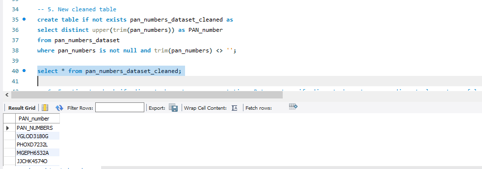
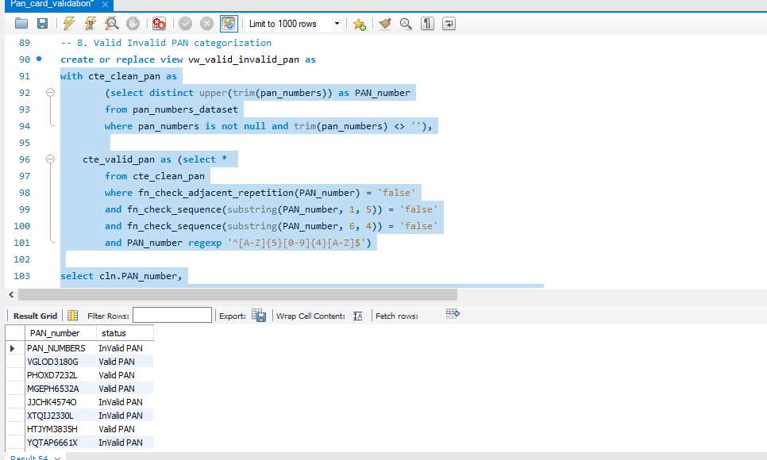
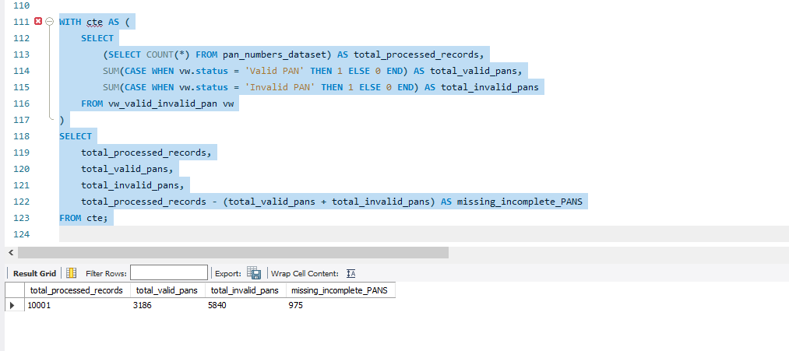

# PAN Number Validation Project (MySQL)

This project provides a **MySQL-based solution to validate and clean PAN (Permanent Account Number) data**.  
It includes SQL scripts to identify invalid or duplicate PAN entries, clean up data formatting, apply validation rules, and generate summary reports.

---

## 📑 Overview  
The repository contains a MySQL script that:

- Cleans and standardizes PAN numbers.
- Validates PAN format according to Indian standards.
- Flags invalid PAN numbers based on sequential/repetitive character checks.
- Generates a summary report of valid, invalid, and missing PAN records.

---

## 🗂️ Features  

- **Data Quality Checks**  
  - Identify missing PAN numbers.  
  - Detect duplicate PAN entries.  
  - Handle leading/trailing spaces.  
  - Standardize letter case to uppercase.  

- **Validation Functions**  
  - `fn_check_adjacent_repetition(p_str)` – Checks for adjacent repeating characters.  
  - `fn_check_sequence(p_str)` – Checks if characters are sequential (e.g., ABCDE, LMNOP).  

- **Data Cleaning**  
  - Creates a cleaned table `pan_numbers_dataset_cleaned` with standardized PANs.  

- **PAN Validation**  
  - Categorizes PAN numbers into **Valid** or **Invalid** using a view `vw_valid_invalid_pan`:  
    - Must match regex: `^[A-Z]{5}[0-9]{4}[A-Z]$`  
    - No adjacent repetition.  
    - No sequential characters in first 5 or numeric part.  

- **Summary Report**  
  - Counts total processed records, valid PANs, invalid PANs, and missing/incomplete PANs.  

---

## 📝 Script Workflow  

1. **Create table & load data**  
   - `pan_numbers_dataset` stores raw PAN numbers.  

2. **Run Data Quality Checks**  
   - Identify missing, duplicate, and improperly formatted PANs.  

3. **Clean Data**  
   - Generate `pan_numbers_dataset_cleaned`.  

4. **Apply Validation Functions**  
   - Use `fn_check_adjacent_repetition` and `fn_check_sequence`.  

5. **Categorize PANs**  
   - Use `vw_valid_invalid_pan` to mark each PAN as Valid or Invalid.  

6. **Generate Summary Report**  
   - Provides quick overview of data quality and PAN validity.  

---

## 📂 Objects Created  

| Object Name                      | Type         | Purpose                                                |
|---------------------------------|--------------|--------------------------------------------------------|
| `pan_numbers_dataset`            | Table        | Stores raw PAN numbers.                                |
| `pan_numbers_dataset_cleaned`    | Table        | Stores cleaned & standardized PAN numbers.             |
| `fn_check_adjacent_repetition`   | Function     | Detects adjacent repeating characters.                 |
| `fn_check_sequence`              | Function     | Detects sequential characters.                        |
| `vw_valid_invalid_pan`           | View         | Categorizes PAN numbers as Valid or Invalid.           |

---

## 🛠️ How to Use  

1. Clone this repository:  
   ```bash
   git clone <your-repo-link>
   ```
2. Import and run the script in your MySQL environment (e.g., MySQL Workbench).
3. Load your PAN data into `pan_numbers_dataset`.
4. Run the queries step-by-step to:
   - Clean data.
   - Validate PAN numbers.
   - Generate summary report.

---

## 📊 Example Queries  

- **Check for adjacent repetition:**  
  ```sql
  SELECT fn_check_adjacent_repetition('helllo');
  ```

- **Check for sequential characters:**  
  ```sql
  SELECT fn_check_sequence('ABCDE');
  ```

- **View valid/invalid PANs:**  
  ```sql
  SELECT * FROM vw_valid_invalid_pan;
  ```

- **Generate summary report:**  
  ```sql
  WITH cte AS (
    SELECT
        (SELECT COUNT(*) FROM pan_numbers_dataset) AS total_processed_records,
        SUM(CASE WHEN vw.status = 'Valid PAN' THEN 1 ELSE 0 END) AS total_valid_pans,
        SUM(CASE WHEN vw.status = 'Invalid PAN' THEN 1 ELSE 0 END) AS total_invalid_pans
    FROM vw_valid_invalid_pan vw
  )
  SELECT
      total_processed_records,
      total_valid_pans,
      total_invalid_pans,
      total_processed_records - (total_valid_pans + total_invalid_pans) AS missing_incomplete_PANS
  FROM cte;

  ```

---

## 🖼️ Sample Output Screenshots  

> Add screenshots of your Workbench or CLI output here:

- Cleaned PAN table  
  

- Valid/Invalid PAN View  
  

- Summary Report  
  

---

## 📝 Notes  

- Regex used for PAN format: `^[A-Z]{5}[0-9]{4}[A-Z]$`  
- Cleaned table & view are refreshed automatically when script is rerun.  
- Functions return `'true'` or `'false'` for checks.  

---

## 📄 License  

This project is open-source. You may use or modify it as needed.  

## 👨‍💻 Author
Developed by **[Prince Doobay]**  
📧 Contact: prince.doobay@yahoo.com  
🌐 GitHub: [Your GitHub Profile](https://github.com/princedoobay)
